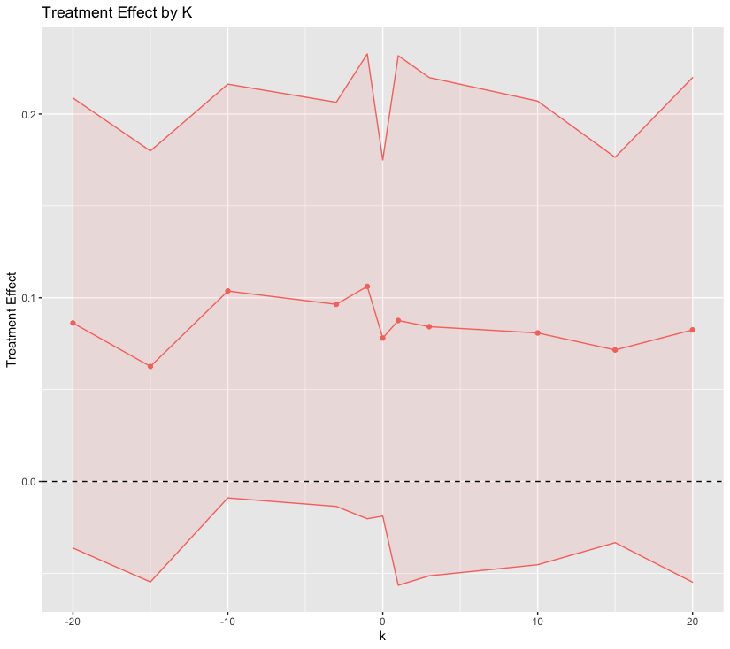

# longdrop2

<!-- badges: start -->
<!-- badges: end -->

The goal of longdrop2 is to:

## Installation

You can install the development version of longdrop2 like so:

``` r
# install.packages("devtools")
devtools::install_github("dnolter959/longdrop2")
```

## Example

This is a basic example which shows you how to solve a common problem:

```{r eval=F}
library(longdrop2)
MAR_model = lmer(WHO5 ~ arm + week + arm*week + (1 + week | uid), data = data)
time_var = "week"
idx_of_coef_of_interest = 4
K = c(-1, 0, 1)
M = 3

ld = longdrop(MAR_model, time_var, idx_of_coef_of_interest, K, M)
plot(ld)
```

```{r, eval=F}
# Load New Data
comgrip<- read.table("/Users/dannolte/Documents/School/Spring2022/BST 226/Homework/HW5/compgrip.txt")
colnames(comgrip) <- c("id", "trt", "y0","y1", "y2", "y3")
head(comgrip)
comgrip.long <- reshape(comgrip, direction = "long", varying = list(colnames(comgrip)[3:6]), 
                        v.names = "y", idvar = "id", timevar = "time", times = c (0, 1,2,3))

comgrip.long <- comgrip.long[order(comgrip.long$id),]
comgrip.long$t <- rep(c(1:4),nrow(comgrip))
col_order <- c("id", "trt", "y", "time", "t")
comgrip.long <- comgrip.long[, col_order]
comgrip.long$mis = rbernoulli()

# Run Package
MAR_model = lmer(y ~ trt + time + trt*time + (1 + time | id), data = comgrip.long)
time_var = "time"
idx_of_coef_of_interest = 4
K = c(-10, -4, -1, 0, 1, 4, 10)
M = 20

ld = longdrop(MAR_model, time_var, idx_of_coef_of_interest, K, M)
plot.longdrop(ld)
```

```{r, eval=F}
plot(longdrop)
```


